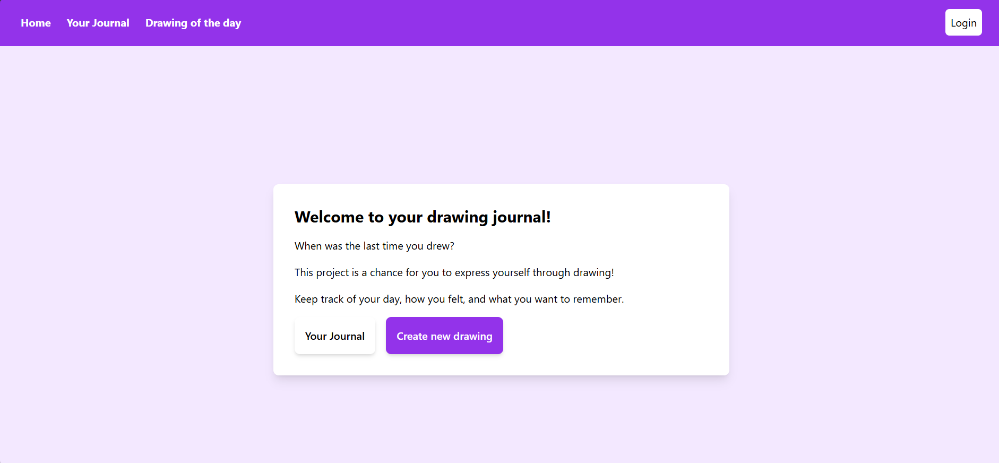
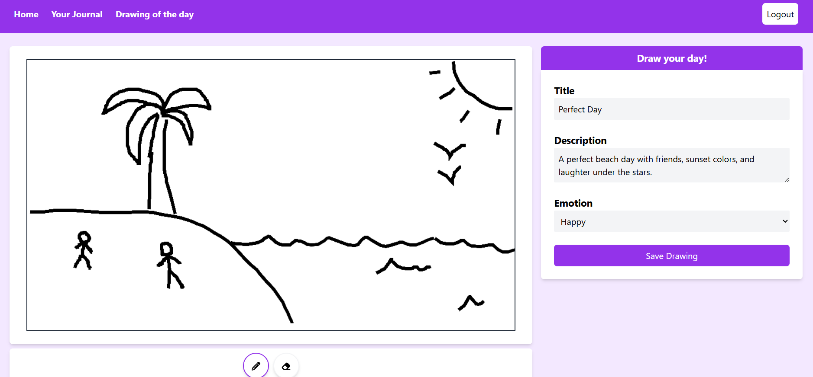
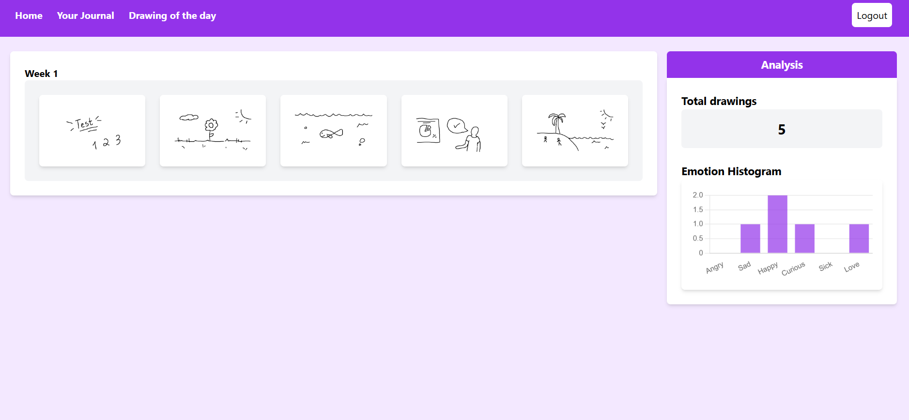
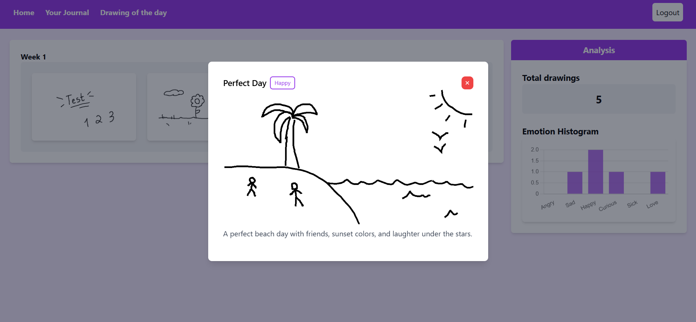

# Drawing Journal

A journal that allows users to express their days visually, adding more than words to their daily reflections.

## Author
- Leonardo Nunes ([@nunesleo](https://www.github.com/nunesleo))

### The program includes:
- A drawing canvas for daily entries
- Fields for a title, description, and the day's emotion
- A tab to view previous entries
- An analysis section to track emotional trends

### Screenshots:

### Technologies:
- React
- Typescript
- Tailwind CSS
- HTML
- Firebase

### Notes/Acknowledgements:
- Project is still under development. I plan to implement functionalities like support for multiple users, streaks, colors.
- As this project was developed for learning purposes, I received support from external sources like mentors, friends, Stack Overflow, and ChatGPT.
